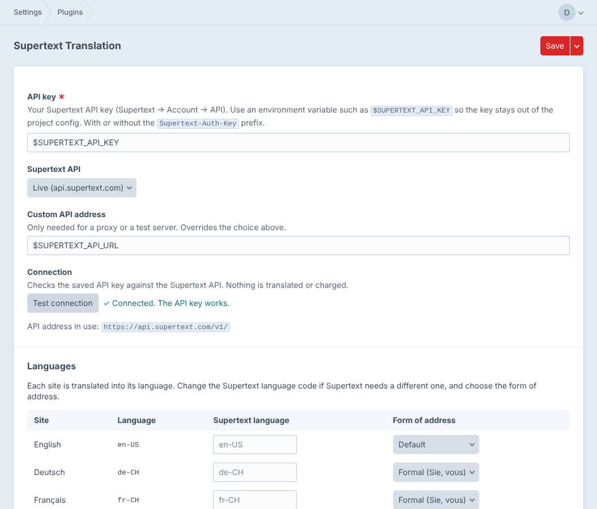
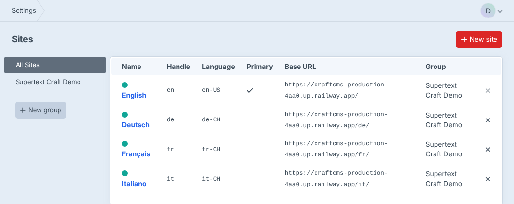
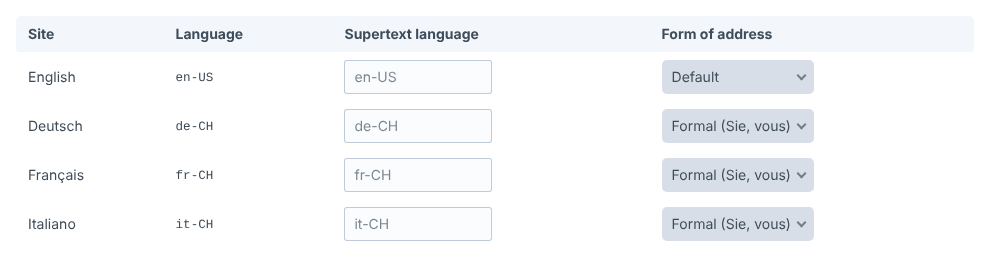

# Installation guide — Supertext Translation for Craft CMS

For administrators who install and set up the plugin. Editors find their part in the [user guide](USER_GUIDE.md).

## Requirements

- Craft CMS 5 (any edition; giving editors their own permissions needs user groups, i.e. Craft Team or Pro), PHP 8.2 or later
- A multi-site setup: one site per language, e.g. *English* (`en-US`), *Deutsch* (`de-CH`), *Français* (`fr-CH`)
- Sections whose entries exist in those sites (*Propagation method* other than "Only save entries to the site they were created in")
- A Supertext account with an API key (Supertext → Account → API)
- The server must reach `https://api.supertext.com` over HTTPS

## Install

The plugin is not in the Plugin Store yet. Install it with Composer from this repository:

```bash
composer config repositories.supertext vcs https://github.com/Supertext/CraftCms-Supertext-Translation
composer require supertext/craft-supertext-translation:dev-main
php craft plugin/install supertext-translation
```

Or install it in *Settings → Plugins* after the `composer require`. Installing creates one database table (`supertext_translations`, which remembers when an entry was last translated into a site).

### Update

```bash
composer update supertext/craft-supertext-translation
php craft up
```

### Uninstall

*Settings → Plugins → Supertext Translation → Uninstall* (or `php craft plugin/uninstall supertext-translation`), then `composer remove supertext/craft-supertext-translation`. Translations already made are normal entry content and stay; only the plugin's table and settings are removed.

## API key

1. Add the key to the server's environment, e.g. in `.env`:

   ```bash
   SUPERTEXT_API_KEY="your-key"
   ```

   You can paste it with or without the `Supertext-Auth-Key ` prefix that Supertext shows. The plugin sends it as `Authorization: Supertext-Auth-Key <key>`.
2. *Settings → Plugins → Supertext Translation*: the **API key** field already contains `$SUPERTEXT_API_KEY`. Keep the variable reference there: the setting is stored in the project config, and with the reference the key itself never ends up in your repository.
3. Click **Test connection**. It calls a cost-free endpoint of the Supertext API and shows *Connected. The API key works.* or the reason it doesn't.



## Languages

The plugin translates into the **language of each site**. Set the languages in *Settings → Sites*; use regional codes where they matter (`de-CH` writes "ss" instead of "ß", `fr-CH` and `it-CH` use Swiss conventions).



In the plugin settings, the **Languages** table lists every site. Per site you can set:

- **Supertext language**: a different Supertext code, if the site's language isn't one Supertext knows (e.g. `de-CH` for a site in `de`).
- **Form of address**: *Formal* (Sie, vous), *Informal* (du, tu) or *Default*.



## Which fields are translated

The plugin translates fields that are translatable in Craft: their **Translation Method** (in the field's settings, or the field layout override) is anything but *Not translatable*. Fields that are the same in every site are left alone. Supported field types: Plain Text, CKEditor (and Redactor), Matrix (the fields of its nested entries), plus each entry's title and slug. Details in the [user guide](USER_GUIDE.md#what-is-translated).

## Permissions

Editors need, in their user group (*Settings → Users → User Groups*):

- **Supertext → Translate entries with Supertext**
- *Access the control panel*, *Edit* permission for **each site** they translate into (*Sites → Edit "Deutsch"*, …)
- The section's *View entries* and *Save entries* (and *View/Save other authors' entries* if the entries aren't theirs)

The plugin checks that the editor may save the entry in every target site before anything is sent to Supertext. Sites they can't edit don't appear in the Supertext box.

## Settings

All settings are in *Settings → Plugins → Supertext Translation* and stored in the project config (change them where admin changes are allowed, e.g. in development, and deploy them).

| Setting | Default | Description |
| --- | --- | --- |
| API key | `$SUPERTEXT_API_KEY` | The key or an environment variable reference. Required. |
| Supertext API | Live | *Live* (`https://api.supertext.com/v1/`), *Staging* or *Testing*. |
| Custom API address | – | A different base URL (proxy, test server); may be an environment variable such as `$SUPERTEXT_API_URL`. Overrides *Supertext API*. |
| Languages | – | Per site: Supertext language code (default: the site's language) and form of address. |
| Timeout | 180 | Seconds to wait for the translation of one site. |

Translated slugs follow Craft's own slug rules: set `limitAutoSlugsToAscii` in `config/general.php` to get `chocolat-suisse-expedie` instead of `chocolat-suisse-expédié`.

## Background translation

The entry index action *Translate with Supertext* translates in Craft's queue. Craft runs the queue automatically on control panel requests; on busy or headless setups run a queue worker (`php craft queue/listen`) or a cron job (`php craft queue/run`).

## Troubleshooting

| Symptom | Cause and fix |
| --- | --- |
| No Supertext box on the entry page | Craft has only one site, the entry exists in only one site, or the user lacks the *Translate entries with Supertext* permission. |
| *Supertext is not set up yet* | The API key setting is empty or its environment variable isn't set on this server. |
| *Authentication failed. Please check the Supertext API key.* | Wrong or revoked key, or a key for another environment (*Live* vs *Staging*). Use *Test connection*. |
| *You are not allowed to edit the entry in this site.* | The editor lacks *Edit* permission for that site or the section's save permissions. |
| *The entry is not available in this site.* | The section doesn't propagate the entry to that site. Enable the site in the entry's *Status* panel or change the section's propagation. |
| *Too many requests to Supertext* | The API's per-second limit was hit repeatedly although the plugin retries. Try again shortly. |
| *Your Supertext translation limit is exceeded.* | The Supertext subscription's quota is used up. |
| *Timed out waiting for the Supertext translation* | Very long content. Raise *Timeout* (and PHP's `max_execution_time`). |
| A field isn't translated | Its Translation Method is *Not translatable*, or its type isn't supported (see above). |
| Bulk translations don't run | The queue isn't running (see *Background translation*). Failed jobs show the reason in *Utilities → Queue Manager*. |

Errors are also written to Craft's log (`storage/logs/`). More technical details are in the [developer guide](DEVELOPER.md).
