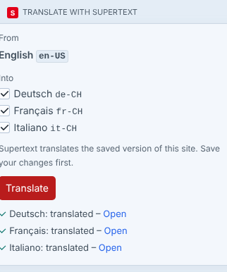
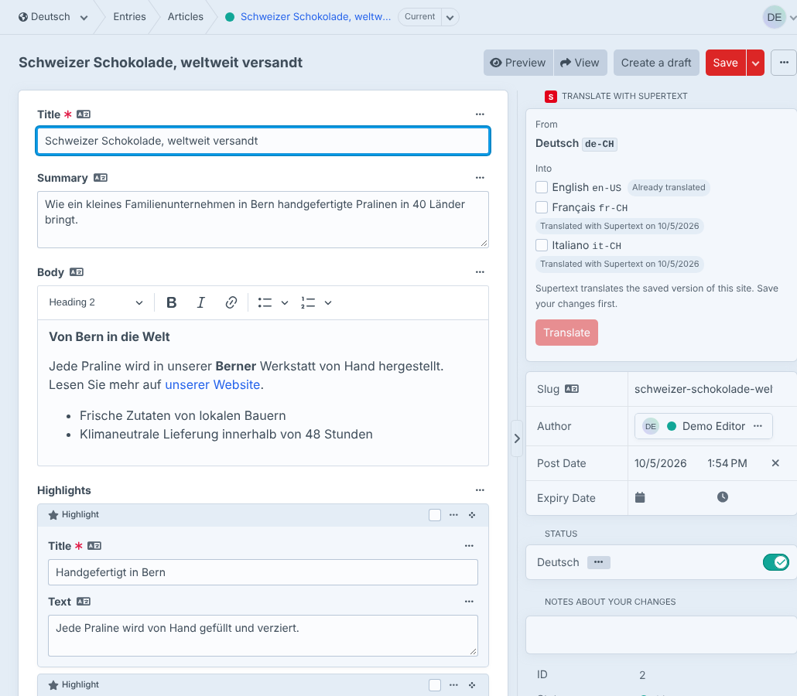
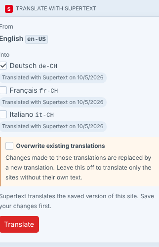
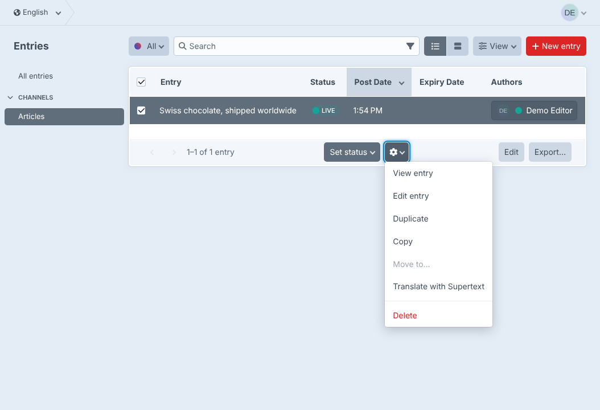

# User guide — Supertext Translation for Craft CMS

For editors who translate entries in the Craft control panel. Your administrator has installed the plugin and set up a site for each language (see the [installation guide](INSTALLATION.md)).

In Craft, every language is a **site**, and an entry has a version in each site. Supertext fills the other sites' versions with a translation of the site you're in.

The Supertext box and its messages appear in your control panel language (English, German, French or Italian).

## Translate an entry

1. Open the entry in the language you translate **from**, e.g. *English* (site menu at the top left).
2. **Save** your changes first. Supertext translates the saved version.
3. In the sidebar, the **Translate with Supertext** box shows:
   - **From**: the site you're in.
   - **Into**: the entry's other sites you may edit. Sites that don't have their own text yet are ticked.
4. Click **Translate**.

Each language takes a few seconds. The box then lists the result per site, with a link to open it:

## Review the translation

Click **Open** (or switch the site at the top left). The translation is saved in that site's version of the entry, exactly as if you had typed it: title, slug, texts, rich text with its headings, bold text, links and lists, and the entries inside Matrix fields.

Change what you like and **Save**. The site's status (enabled or disabled) doesn't change: if a site's version was live before, the translation is live right away. To review first, disable the entry for that site, translate, review, then enable it.

Every translation is saved as a new **revision** with the note *Translated with Supertext from English*. To undo a translation, open the revision menu (*Current*, next to the entry's name at the top), choose the earlier revision and click *Revert content from this revision*.

## Translate again or update a translation

Sites that already have their own text are not ticked, and show **Already translated** or **Translated with Supertext on** *date*. If you tick one, the box asks whether to overwrite it:

- Leave **Overwrite existing translations** off: those sites are skipped (*already translated, skipped*); only sites without their own text are translated. Your changes are safe.
- Turn it on: the translatable fields of those sites are replaced with a new translation of the current source. **Changes made in those sites are lost** (the previous version stays in the revisions). Use this after the source text has changed.

"Its own text" means: at least one translatable field differs from the source site.

## Translate many entries at once

In the entry list, select entries, open the **actions menu** (gear icon) and choose **Translate with Supertext**. Each selected entry is translated from the site the list shows into all its other sites, in the background. Sites that already have their own text are skipped; to overwrite them, use the box on the entry page.

Progress and errors appear in Craft's queue indicator (bottom left); failed jobs are listed under *Utilities → Queue Manager*.

## What is translated

| Content | What happens |
| --- | --- |
| Title | Translated (unless the entry type's title is *Not translatable*) |
| Slug | Translated as words and turned back into a slug, e.g. `swiss-chocolate-shipped-worldwide` → `schweizer-schokolade-weltweit-versandt`. A one-word slug stays as it is. |
| Plain Text fields | Translated, line breaks kept |
| CKEditor (and Redactor) fields | Translated as HTML: headings, bold, italic, links and lists stay in place, link addresses are kept |
| Matrix fields | The title and the fields above of each nested entry are translated |
| Fields that are *Not translatable* | Not touched (they are the same in every site) |
| Other field types (numbers, dates, assets, relations, dropdowns, tables, links, …) | Not translated |

Empty fields are skipped. Entries nested inside CKEditor fields are not translated yet.

## Messages

| Message | Meaning |
| --- | --- |
| *Supertext is not set up yet: …* | No API key. Ask your administrator. |
| *already translated, skipped* | The site has its own text and *Overwrite existing translations* was off. |
| *You are not allowed to edit the entry in this site.* | Your user group may not edit that site or the section. |
| *The entry is not available in this site.* | The entry isn't enabled in that site. |
| *Authentication failed. Please check the Supertext API key.* | The API key is wrong. Ask your administrator. |
| *Your Supertext translation limit is exceeded.* | Your organisation's Supertext limit is used up. |
| *Too many requests to Supertext. Please try again shortly.* | Supertext was busy; try again in a moment. |
| *Timed out waiting for the Supertext translation.* / *The Supertext service is currently unavailable.* | Supertext took too long or is unavailable. Try again later. |
| *The translation could not be saved: …* | Craft refused to save the translated version (e.g. a required field is empty in that site). The reason follows. |

Errors are shown per site: if one site fails, the others are still translated and saved.
